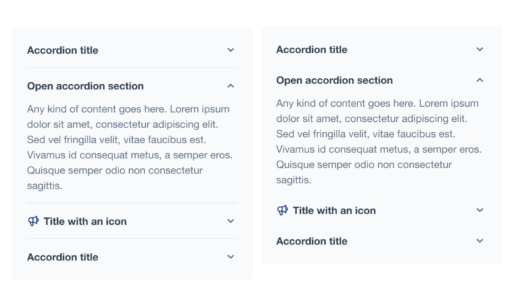

# Hyvä UI - accordion.A - basic

[![License]](../../../LICENSE.md)
[![Hyva Supported Versions]](https://docs.hyva.io/hyva-ui-library/getting-started.html)
[![Tailwind Supported Versions]](https://tailwindcss.com/)
[![Figma]](https://www.figma.com/@hyva)
[![included-with-hyva-cms]](https://www.hyva.io/hyva-commerce.html)
[![wysiwyg-support]](https://docs.hyva.io/hyva-ui-library/faqs/cms-components.html)

Build accessible accordions using HTML and Tailwind CSS. This solution utilizes native browser support in modern browsers and falls back to a standard collapse in older browsers.

## Usage - CMS

1. Ensure you've installed CMS Tailwind JIT module in your project (see [Requirements](#requirements) below)
2. Copy the contents from `cms-content` into your CMS page or Block
3. Adjust the content and code to fit your own needs and save
4. Refresh the cache

## Usage - Template

1. Copy or merge the following files/folders into your theme:
   * `Magento_Theme/templates/elements/accordion`
   * `Magento_Theme/layout/cms_index_index.xml`
   * `web/tailwind/theme/components/collapse.css`
2. Make sure to import the `collapse.css` in your `tailwind-source.css` file
3. Adjust the content and code to fit your own needs and save
4. Create your development or production bundle by running `npm run watch` or `npm run build` in your
   theme's tailwind directory

### Configuration Options

This UI component offers customization options without modifying the corresponding phtml files.

To configure this UI component,
utilize the provided options as outlined in the `src/Magento_Theme/layout/cms_index_index.xml` file.

| Option Name       | Type    | Available Values     | Default | Description                                                  |
| ----------------- | ------- | -------------------- | ------- | ------------------------------------------------------------ |
| `multiselectable` | boolean | true, false          | true    | Disables the accordion effect                                |
| `divider`         | boolean | true, false          | true    | Controls whether a divider should be displayed between items |
| `name`            | string  | _Name for Accordion_ |         | Use your own accordion name                                  |
| `classes`         | string  | _CSS classes_        |         | Use your own CSS classses or remove the defaults             |

#### Configuration Options `child_template`

| Option Name | Type    | Available Values | Default   | Description                                              |
| ----------- | ------- | ---------------- | --------- | -------------------------------------------------------- |
| `title`     | string  |                  | `Details` | Title to use                                             |
| `content`   | string  |                  |           | (Optional) use this argument to display the content _*1_ |
| `open`      | boolean | true, false      | true      | Controls whether accordion item is open by default       |
| `icon`      | string  | _Path to icon_   |           | Show icon before title _*2_                              |

> 1: `content` if a child block is used this value will be ignored
>
> 2: Path to the icon, for example: `heroicons/outline/speakerphone`,
> similar to the [Hyvä Docs on Custom svg icons] you can also use a custom icon

[Hyvä Docs on Custom svg icons]: https://docs.hyva.io/hyva-themes/writing-code/working-with-view-models/svgicons.html#using-a-custom-svg-icon-set-in-your-theme

## Preview

## Requirements

### [CMS Tailwind JIT]

This component works with the [CMS Tailwind JIT] module to seamlessly integrate Tailwind CSS classes into your CMS content.

This module enables direct pasting of `cms-content` contents into CMS pages or blocks,
automatically generating the corresponding Tailwind CSS styles.

For installation instructions, refer to the [CMS Tailwind JIT] module's documentation.

## Notes

Height animations are implemented using modern CSS features, providing a progressive enhancement.

Older browsers that do not support these features will gracefully fall back to a static height, maintaining core functionality.

---

The CMS version utilizes Tailwind's arbitrary classes to minimize dependencies by avoiding a dedicated CSS component.

Alternatively, for cleaner HTML and easier maintenance,
you can integrate the provided CSS component into your theme styles and replace the Tailwind classes,
mirroring the Template version's approach.

To apply the same visual styling within the admin,
copy the contents of `collapse.css` into your custom styles for the CMS Tailwind JIT,
as detailed in our documentation: [docs](https://docs.hyva.io/hyva-themes/cms/cms-tailwind-jit-module.html#custom-user-css).

## License

Hyvä Themes - https://hyva.io

Copyright © Hyvä Themes B.V 2020-present. All rights reserved.

This product is licensed per Magento install. Please see the LICENSE.md file in the root of this repository for more
information.

[License]: https://img.shields.io/badge/License-004d32?style=for-the-badge "Link to Hyvä License"
[Figma]: https://img.shields.io/badge/Figma-gray?style=for-the-badge&logo=Figma "Link to Figma"
[CMS Tailwind JIT]: https://docs.hyva.io/hyva-themes/cms/using-tailwind-classes-in-cms-content.html
[wysiwyg-support]: https://img.shields.io/badge/wysiwyg_support-ffc803?style=for-the-badge
[included-with-hyva-cms]: https://img.shields.io/badge/Hyv%C3%A4_CMS-109c85?style=for-the-badge

[Hyva Supported Versions]: https://img.shields.io/badge/Hyv%C3%A4-1.3,_1.4-0A23B9?style=for-the-badge&labelColor=0A144B "Hyvä Supported Versions"
[Tailwind Supported Versions]: https://img.shields.io/badge/Tailwind-3,_4-06B6D4?style=for-the-badge&logo=TailwindCSS "Tailwind Supported Versions"
