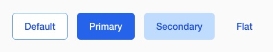

# Hyvä UI - button - a.basic

[![License]](../../../LICENSE.md)
[![Hyva Supported Versions]](https://docs.hyva.io/hyva-ui-library/getting-started.html)
[![Tailwind Supported Versions]](https://tailwindcss.com/)
[![Figma]](https://www.figma.com/@hyva)

This component replaces the standard button styles with a new look and feel.

## Usage - Template

1. Copy or merge the following files/folders into your theme:
   * `web/tailwind/components/button.css`
2. Adjust the content and code to fit your own needs and save
3. Create your development or production bundle by running `npm run watch` or `npm run build` in your
   theme's tailwind directory

## Preview

## Notes

Similar to the button introduced in the default theme version 1.3.11,
this button now utilizes CSS variables, simplifying color customization across your project.

## License

Hyvä Themes - https://hyva.io

Copyright © Hyvä Themes B.V 2020-present. All rights reserved.

This product is licensed per Magento install. Please see the LICENSE.md file in the root of this repository for more
information.

[License]: https://img.shields.io/badge/License-004d32?style=for-the-badge "Link to Hyvä License"
[Figma]: https://img.shields.io/badge/Figma-gray?style=for-the-badge&logo=Figma "Link to Figma"

[Hyva Supported Versions]: https://img.shields.io/badge/Hyv%C3%A4-1.4-0A23B9?style=for-the-badge&labelColor=0A144B "Hyvä Supported Versions"
[Tailwind Supported Versions]: https://img.shields.io/badge/Tailwind-4-06B6D4?style=for-the-badge&logo=TailwindCSS "Tailwind Supported Versions"
