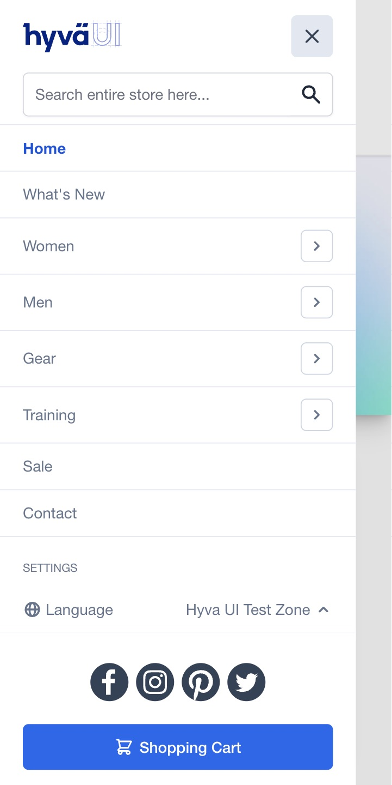

# Hyvä UI - mobile-menu.A - scroll

[![License]](../../../LICENSE.md)
[![Hyva Supported Versions]](https://docs.hyva.io/hyva-ui-library/getting-started.html)
[![Tailwind Supported Versions]](https://tailwindcss.com/)
[![AlpineJS Supported Versions]](https://alpinejs.dev/)
[![Figma]](https://www.figma.com/@hyva)

This UI component provides a reimagined implementation of the Hyvä Mobile Menu,
offering a flexible and extensible foundation for your mobile navigation.

## Usage - Template

1. Ensure you've installed `x-htmldialog` in your project (see [Requirements](#requirements) below)
2. Copy or merge the following files/folders into your theme:
   * `Magento_Directory/templates`
   * `Magento_Directory/layout/default.xml`
   * `Magento_Store/templates/header/menu/languages.phtml`
   * `Magento_Store/layout/default.xml`
   * `Magento_Theme/templates/html`
   * `Magento_Theme/layout/default.xml`
   * `Hyva_Theme/web/svg`
3. Adjust the content and code to fit your own needs and save
4. Create your development or production bundle by running `npm run watch` or `npm run build` in your
   theme's tailwind directory

### Configuration Options

This UI component offers customization options without modifying the corresponding phtml files.

To configure this UI component,
utilize the provided options as outlined in the `src/Magento_Theme/layout/default.xml` file.

| Option Name                    | Type    | Available Values | Default | Description                                         |
| ------------------------------ | ------- | ---------------- | ------- | --------------------------------------------------- |
| `max_level`                    | number  | _Number Range_   | 4       | Max Menu depth to show                              |
| `show_search`                  | boolean | true, false      | true    | Show Search field                                   |
| `show_socials`                 | boolean | true, false      | true    | Show Social Icons                                   |
| `show_settings_nav`            | boolean | true, false      | true    | Show Extra Nav with Language and Currency Settings  |
| `additional_menu_items_before` | array   |                  |         | Extra Menu items to show before the Main Menu Items |
| `additional_menu_items`        | array   |                  |         | Extra Menu items to show after the Main Menu Items  |

<details><summary>Option <code>additional_menu_items_before</code> and <code>additional_menu_items</code> explained</summary>

Both options use a xml array of items, that need to include a `url` and `name` item as shown below, in the example:

```xml
<argument name="additional_menu_items" xsi:type="array">
    <item name="contact" xsi:type="array">
        <item name="url" xsi:type="string">/contact</item>
        <item name="name" xsi:type="string" translate="true">Contact Us</item>
    </item>
</argument>
```

Optionally you can also add the `external` item to the menu item.

</details>

## Preview



## Requirements

### AlpineJS `x-htmldialog`

To enable this component, the Alpine.js [x-htmldialog] plugin is necessary. Follow these steps for integration:

1.  From the `alpine-htmldialog` plugin directory, copy `Magento_Theme/templates/page/js/plugins/htmldialog.phtml` into your theme or module's template folder.
2.  Similarly, copy `Magento_Theme/layout/default.xml` from the `alpine-htmldialog` plugin directory into your theme or module's layout folder.

## Notes

This UI component supports the addition of custom widgets within the "Mobile Menu Footer" location.

The Settings Accordion utilizes the HTML details element with the name attribute for enhanced accessibility.
This modern approach is supported in all major browsers.
For older browsers, a standard collapse mechanism will be used as a fallback.

---

For optimal integration and visual consistency, it is recommended to use this component in conjunction with the Hyvä UI Headers.

When using this component with the Default Theme Header,
ensure that the following CSS classes `order-2 sm:order-1 lg:order-2`  are applied to the `Magento_Theme/templates/html/header/menu/mobile.phtml` wrapper.

## License

Hyvä Themes - https://hyva.io

Copyright © Hyvä Themes B.V 2020-present. All rights reserved.

This product is licensed per Magento install. Please see the LICENSE.md file in the root of this repository for more
information.

[License]: https://img.shields.io/badge/License-004d32?style=for-the-badge "Link to Hyvä License"
[Figma]: https://img.shields.io/badge/Figma-gray?style=for-the-badge&logo=Figma "Link to Figma"
[x-htmldialog]: https://fylgja.dev/library/extensions/alpinejs-dailog/

[Hyva Supported Versions]: https://img.shields.io/badge/Hyv%C3%A4-1.3.11,_1.4-0A23B9?style=for-the-badge&labelColor=0A144B "Hyvä Supported Versions"
[Tailwind Supported Versions]: https://img.shields.io/badge/Tailwind-3-06B6D4?style=for-the-badge&logo=TailwindCSS "Tailwind Supported Versions"
[AlpineJS Supported Versions]: https://img.shields.io/badge/AlpineJS-3-8BC0D0?style=for-the-badge&logo=alpine.js "AlpineJS Supported Versions"
