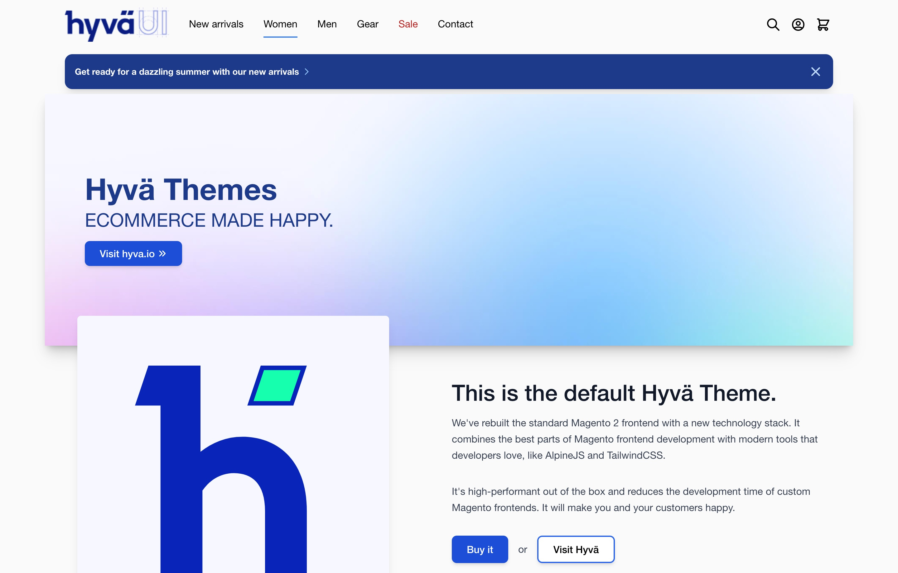

# Hyvä UI - menu.A - simple static links

[![License]](../../../LICENSE.md)
[![Hyva Supported Versions]](https://docs.hyva.io/hyva-ui-library/getting-started.html)
[![Tailwind Supported Versions]](https://tailwindcss.com/)
[![AlpineJS Supported Versions]](https://alpinejs.dev/)
[![Figma]](https://www.figma.com/@hyva)

This UI component renders menu links using a static array.

It's ideal for scenarios where you need different menus for desktop and mobile layouts.

## Usage - Template

1. Copy or merge the following files/folders into your theme:
   * `Magento_Theme/templates/html/header/menu/desktop.phtml`
2. Adjust the content and code to fit your own needs and save
3. Create your development or production bundle by running `npm run watch` or `npm run build` in your
   theme's tailwind directory

### Configuration Options

This UI component offers customization options without modifying the corresponding phtml files.

To configure this UI component,
utilize the provided options as outlined in the `src/Magento_Theme/layout/default.xml` file.

| Option Name  | Type  | Available Values | Default | Description        |
| ------------ | ----- | ---------------- | ------- | ------------------ |
| `menu_items` | array |                  |         | Menu items to show |

<details><summary>Option <code>menu_items</code> explained</summary>

This option uses a xml array of items, that need to include a `url` and `name` item as shown below, in the example:

```xml
<argument name="menu_items" xsi:type="array">
    <item name="home" xsi:type="array">
        <item name="url" xsi:type="string">/</item>
        <item name="name" xsi:type="string" translate="true">Home</item>
    </item>
</argument>
```

Optionally you can also add the `external` item to the menu item.

</details>

## Preview



## Notes

It's recommended to pair Menu.A with Header.A for the best results (as shown in the previews).

However, Menu.A is also flexible and can be used with other UI Headers, including the Default Theme Header.

For the Default Theme Header specifically,
you'll need to apply the classes `order-2 sm:order-1 lg:order-2` to the top element of your Menu.A to maintain the intended layout.

## License

Hyvä Themes - https://hyva.io

Copyright © Hyvä Themes B.V 2020-present. All rights reserved.

This product is licensed per Magento install. Please see the LICENSE.md file in the root of this repository for more
information.

[License]: https://img.shields.io/badge/License-004d32?style=for-the-badge "Link to Hyvä License"
[Figma]: https://img.shields.io/badge/Figma-gray?style=for-the-badge&logo=Figma "Link to Figma"

[Hyva Supported Versions]: https://img.shields.io/badge/Hyv%C3%A4-1.3.11,_1.4-0A23B9?style=for-the-badge&labelColor=0A144B "Hyvä Supported Versions"
[Tailwind Supported Versions]: https://img.shields.io/badge/Tailwind-3-06B6D4?style=for-the-badge&logo=TailwindCSS "Tailwind Supported Versions"
[AlpineJS Supported Versions]: https://img.shields.io/badge/AlpineJS-3-8BC0D0?style=for-the-badge&logo=alpine.js "AlpineJS Supported Versions"
