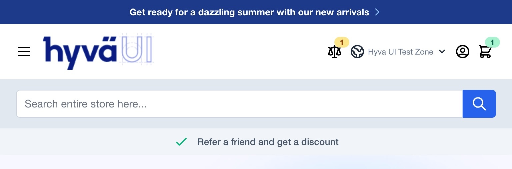

# Hyvä UI - search-form.A - header

[![License]](../../../LICENSE.md)
[![Hyva Supported Versions]](https://docs.hyva.io/hyva-ui-library/getting-started.html)
[![Tailwind Supported Versions]](https://tailwindcss.com/)
[![AlpineJS Supported Versions]](https://alpinejs.dev/)
[![Figma]](https://www.figma.com/@hyva)

This component replaces the standard search form in Hyvä Header and it's UI versions with a new look and feel.

> This also includes support for Hyva SmileElasticsuite

## Usage - Template

1. Copy or merge the following files/folders into your theme:
    * `app/Hyva_UI/components/header-search/src/Magento_Theme/templates/html/header/search-form.phtml`
    * Optionally if using your using `Hyva_SmileElasticsuite` also copy:
        * `app/Hyva_UI/components/header-search/src/Hyva_SmileElasticsuite/templates/core/search/form.mini.phtml`
2. Adjust the content and code to fit your own needs and save
3. Create your development or production bundle by running `npm run watch` or `npm run build` in your
   theme's tailwind directory

## Preview

## Notes

This is a complementary UI component for Hyvä UI Headers.

The autocomplete is not the same style compared between the Hyvä Theme and Smile Elasticsuite.

---

Like the Hyvä Smile Elasticsuite Compatibility module,
the Smile Elasticsuite parts of this UI component are currently incompatible with Content Security Policy (CSP).

CSP support will be added when the Hyvä Smile Elasticsuite Compatibility module achieves CSP compliance.

## License

Hyvä Themes - https://hyva.io

Copyright © Hyvä Themes B.V 2020-present. All rights reserved.

This product is licensed per Magento install. Please see the LICENSE.md file in the root of this repository for more
information.

[License]: https://img.shields.io/badge/License-004d32?style=for-the-badge "Link to Hyvä License"
[Figma]: https://img.shields.io/badge/Figma-gray?style=for-the-badge&logo=Figma "Link to Figma"

[Hyva Supported Versions]: https://img.shields.io/badge/Hyv%C3%A4-1.3.11,_1.4-0A23B9?style=for-the-badge&labelColor=0A144B "Hyvä Supported Versions"
[Tailwind Supported Versions]: https://img.shields.io/badge/Tailwind-3-06B6D4?style=for-the-badge&logo=TailwindCSS "Tailwind Supported Versions"
[AlpineJS Supported Versions]: https://img.shields.io/badge/AlpineJS-3-8BC0D0?style=for-the-badge&logo=alpine.js "AlpineJS Supported Versions"
